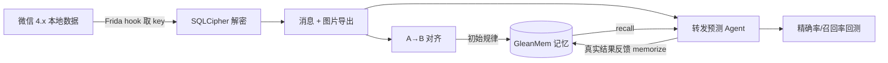

# 微信转发观察 · 记忆系统可靠性验证

用一个**真实业务场景**端到端检验 GleanMem（拾忆）记忆系统：监控两个微信群的转发关系，
学习历史转发模式，预测新消息是否会被转发，再用真实结果衡量记忆是否可靠。

## 场景

| 群 | 名称 | chatroom id |
|---|---|---|
| A（来源） | 磐金-建翔业务沟通群 | `53423449835@chatroom` |
| B（目标） | 【内部】磐金协议分享 | `53531139660@chatroom` |

业务上，某人（主力为「加一」）会把 A 群里可执行的业务信息转发到 B 群。

## 整体链路



全程本机读取，数据不外传。初始化（建 Space、录入原始记忆）走**前端页面真实操作**；
Agent 行为走真实 REST HTTP（`Authorization: Bearer <space_key>`），不直写数据库。

## 目录

```
.venv/              工作区独立环境（固定，不依赖 /tmp）
requirements.txt    固定依赖版本
wxread/             可复用的 macOS 微信 4.x 读取层
  paths.py            路径发现
  keyextract.py       Frida 提取 DB key + kvcomm 派生图片 key
  decrypt.py          SQLCipher 4 分页解密
  imagedecode.py      V2 图片容器解码（缩略图 JPEG / 原图 wxgf）
  align.py            文本相似度 + 图片内容哈希对齐
  agent.py            转发预测 Agent（接 GleanMem）
  gleanmem_client.py  GleanMem REST 客户端（业务 + 管理员）
scripts/
  setup.sh            一键建 .venv + 装依赖 + 装浏览器
  export_groups.py    一键导出 A/B 文本+图片
  save_images.py      图片解码落盘
  run_align.py        生成转发对
  init_memory.py      页面操作初始化原始记忆
  backtest.py         幂等时间切片回测（自动建/归档临时 Space）
output/              数据集、密钥、转发对、回测明细（gitignore，含隐私）
```

## 复现步骤

```bash
# 0. 基础设施
docker compose -f gleanmem/docker-compose.yml up -d
cd gleanmem/backend && uv run alembic upgrade head
uv run uvicorn gleanmem.main:app --port 8000 &
cd ../frontend && npm run dev          # http://localhost:5173

# 1. 固定环境（一次性；之后都用工作区 .venv，不依赖 /tmp）
cd spike/wechat-forward
bash scripts/setup.sh

# 2. 导出微信数据（微信须在运行；首次取 key 需打开会话/群详情触发解密）
.venv/bin/python scripts/export_groups.py
.venv/bin/python scripts/save_images.py

# 3. 对齐
.venv/bin/python scripts/run_align.py

# 4. 页面初始化记忆（可选）+ 幂等回测
.venv/bin/python scripts/init_memory.py
.venv/bin/python scripts/backtest.py          # --keep 可保留临时 Space 到前端查看
```

## 可重复性

- **环境固定**：依赖装进工作区 `.venv`，版本锁在 `requirements.txt`（frida 16.7.19 /
  pycryptodome 3.23.0 / playwright 1.63.0），重启机器后直接可用，无需 /tmp。
- **回测幂等**：`backtest.py` 每次运行自动归档同名旧 Space、新建干净 Space，
  训练 → 测试结束后再自动归档；多次运行不会累积旧案例。
- 无记忆基线结果**完全确定**；有记忆组在极少量“边界分”消息上可能因 FTS 检索的
  排序产生 1 条差异（F1 ±0.03），属小样本边界现象，不影响整体结论。

## 对齐结果（ground truth）

| 类型 | 转发对数 | 识别方式 |
|---|---|---|
| 文本 | 56 | 时间窗内文本相似度 ≥ 0.6 |
| 图片 | 259 | 解码后内容 sha256 完全相同 |
| **合计** | **315** | |

- 转发人（文本）：加一 38、付龙 8、刘茂武 4、张有为 3、单庆波 2、马英龙 1。
- 文本转发延迟：中位约 5 分钟，90 分位约 19 分钟。
- 图片转发几乎零改写（259 张缩略图字节完全一致）。

## 记忆可靠性结论

**已经可靠验证的部分（记忆系统的本职）：**

1. **写入→召回闭环正确。** 录入的规律能被 `recall` 精准检索（3/3），权重、类型、
   可召回状态符合设计（reference 类 pending 即可召回）。
2. **跨模态信息可对齐。** 文本与图片都能稳定识别转发，315 条 ground truth 无歧义。
3. **记忆可被真实 agent 使用。** Agent 能 recall 历史规律与案例，并据此调整预测。

**预测指标（小样本，谨慎解读）：**

| 配置 | precision | recall | F1 | accuracy |
|---|---|---|---|---|
| 有记忆 | 0.29 | 0.31 | 0.30 | 0.87 |
| 无记忆基线 | 0.24 | 0.54 | 0.33 | 0.81 |

## 局限（不回避）

- **正样本太少。** 文本转发仅 56 条，且高度集中在 5–6 月；单次测试窗口只有 13 个
  正例，F1 在 0.04 量级的摆动不具统计显著性。**不能据此宣称"记忆让预测更准"。**
- 当前预测器是启发式规则，不是 LLM；记忆以"特征先验"方式介入，检索精度受 FTS
  召回噪声影响。记忆组在 precision 上有提升，但 recall 下降，属权衡而非全面增益。
- 原图为微信自研 `wxgf` 格式，本次用缩略图（JPEG）做内容对齐，已足够识别转发。

## 对 GleanMem 的最终评价

这个实验证明了记忆系统在**真实接入场景下工程上可靠**：能存、能取、能被 agent
实际使用，且文本/图片双通道对齐准确。但"记忆是否提升任务效果"需要**更大样本和
更长观察周期**才有说服力——这与设计文档里"先真实使用、再用数据解冻"的判断一致。
下一步应持续采集 A/B 群数据，累计足够正例后再做统计检验，而非在小样本上调阈值。
